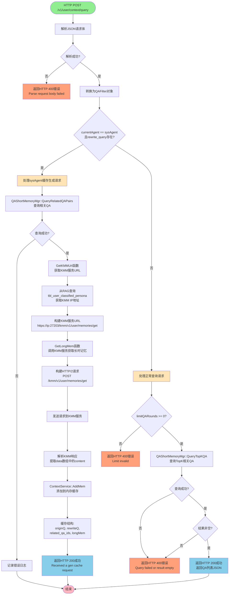
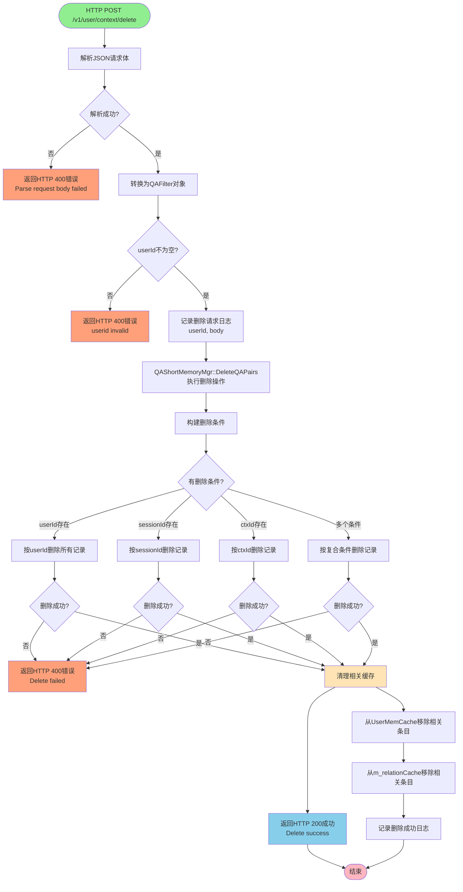
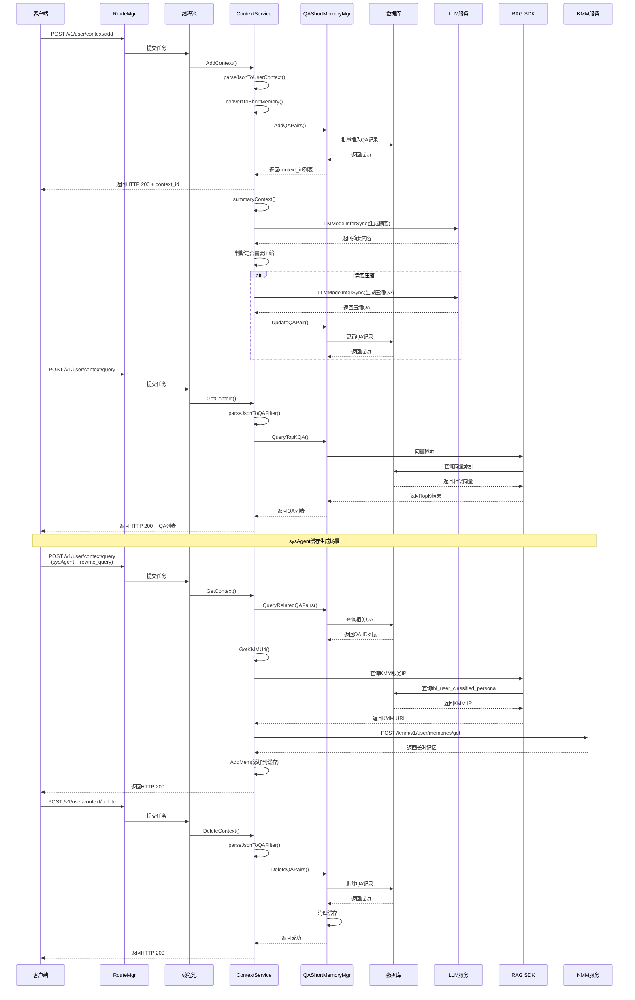

# DMContextService 架构文档

## 1. 项目概述

DMContextService是一个上下文工程服务，负责管理用户对话上下文、短时记忆和长时记忆的存储、检索和智能摘要。该服务基于C++17开发，采用分层架构设计，提供RESTful API接口，支持多实例部署和高并发处理。

### 1.1 核心功能
- **上下文管理**：存储和管理用户的对话历史（问答对）
- **智能摘要**：使用LLM自动生成对话摘要和压缩内容
- **记忆检索**：基于语义相似度检索相关历史对话
- **查询重写**：利用上下文信息优化用户查询
- **长时记忆集成**：与KMM（Knowledge Memory Management）服务集成获取长时记忆

## 2. 整体架构

### 2.1 分层架构设计

项目采用严格的分层架构，遵循依赖倒置原则（DIP）：

```
┌───────────────────────────┐
│        Controller         │  控制层 - 处理HTTP请求路由
├───────────────────────────┤
│        Business           │  业务逻辑层 - 实现核心业务规则
├───────────────────────────┤
│        Domain             │  领域模型层 - 数据结构和业务对象
├───────────────────────────┤
│        Common             │  公共工具层 - 通用工具函数
├───────────────────────────┤
│    Infrastructure         │  基础设施层 - 技术实现细节
└───────────────────────────┘
```

### 2.2 架构原则
1. **依赖倒置原则（DIP）**：高层模块定义抽象接口，低层模块实现接口
2. **分层通信规范**：上层可以调用下层接口，禁止下层直接调用上层
3. **跨层访问处理**：使用依赖注入
4. **命名规则**：
   - 文件命名：小驼峰，中间通过_分割
   - 类名：大驼峰
   - 类成员：m_前缀
   - 全局变量：g_前缀

## 3. 目录结构

```
service/
├── main.cpp                          # 服务入口文件
├── CMakeLists.txt                    # 构建配置文件
├── include/                          # 头文件目录
│   ├── business/                     # 业务逻辑层
│   │   ├── context/                  # 上下文管理
│   │   │   ├── context_service.h     # 上下文服务
│   │   │   ├── qa_manager.h          # QA管理器
│   │   │   └── utils.h               # 工具函数
│   │   └── memory/                   # 记忆管理
│   │       ├── qa_short_memory_service.h
│   │       ├── qa_short_memory_mgr.h
│   │       └── qa_short_memory_executor.h
│   ├── controller/                   # 控制层
│   │   └── route_mgr.h               # 路由管理
│   ├── domain/                       # 领域模型层
│   │   ├── bean/                     # 业务对象
│   │   │   └── qa_short_memory.h     # QA短时记忆实体
│   │   ├── config/                   # 配置管理
│   │   │   ├── config_mgr.h          # 配置管理器
│   │   │   └── scene_cfg.h           # 场景配置
│   │   ├── datatable/                # 数据表操作
│   │   │   ├── database_mgr.h        # 数据库管理器
│   │   │   ├── data_management_base.h
│   │   │   └── qa_short_memory_tbl.h # QA表操作
│   │   ├── microservice/             # 微服务管理
│   │   │   └── microservice_mgr.h    # 微服务管理器
│   │   └── modeladapter/             # 模型适配
│   │       └── model_infer_executor.h
│   ├── infrastructure/               # 基础设施层
│   │   ├── database/                 # 数据库
│   │   │   └── rag/                  # RAG相关
│   │   │       └── rag_mgr.h         # RAG管理器
│   │   ├── embedding/                # 向量嵌入
│   │   │   └── embedding_service.h   # 嵌入服务
│   │   ├── model/                    # 模型推理
│   │   │   ├── model_mgr.h           # 模型管理器
│   │   │   ├── model_infer.h         # 模型推理
│   │   │   └── llm_callback.h        # LLM回调
│   │   ├── python_service/           # Python服务
│   │   │   ├── python_service.h
│   │   │   └── py_memory_service_mgr.h
│   │   └── queue/                    # 队列
│   │       ├── blocking_message_queue.h
│   │       └── event_log_queue_handler.h
│   └── common/                       # 公共工具层
│       ├── common_define.h           # 通用定义
│       ├── common_utils.h            # 通用工具
│       ├── concurrent_executor.h     # 并发执行器
│       ├── datatime_util.h           # 时间工具
│       ├── file_utils.h              # 文件工具
│       ├── http_helper.h             # HTTP辅助
│       ├── json_parser.h             # JSON解析
│       ├── logger.h                  # 日志
│       ├── multi_tree.h              # 多叉树
│       ├── packet_manager.h          # 包管理
│       ├── singleton.h               # 单例模式
│       ├── snowflake.h               # 雪花ID
│       └── string_parser.h           # 字符串解析
└── src/                              # 源文件目录
    └── (对应include目录的cpp文件)
```

## 4. 核心模块详解

### 4.1 控制层（Controller）

#### RouteMgr (route_mgr.h/cpp)
**职责**：HTTP请求路由管理

**核心功能**：
- 注册REST API路由
- 管理线程池分配
- 异步处理HTTP请求

**对外接口**：
```cpp
void InitRestRouter();
std::shared_ptr<ThreadPool> GetQueryThreadPool();
std::shared_ptr<ThreadPool> GetCommThreadPool();
```

**注册的API路由**：
- `POST /v1/user/context/add` - 添加上下文
- `POST /v1/user/context/query` - 查询上下文
- `POST /v1/user/context/delete` - 删除上下文

**线程池配置**：
- 查询线程池：32个线程（处理耗时操作）
- 通用线程池：4个线程（处理非耗时操作）

### 4.2 业务逻辑层（Business）

#### ContextService (context_service.h/cpp)
**职责**：上下文业务逻辑处理

**核心数据结构**：
```cpp
struct ContextItem {
    std::string query;          // 用户问题
    std::string answer;         // 系统回答
    std::string customSummary;  // 自定义摘要
    std::string reWriteQuery;   // 重写的问题
    std::string date;           // 日期
};

struct UserContext {
    std::string userId;
    std::string subUserId;
    std::string sessionId;
    std::string agentName;
    std::string label;
    std::vector<ContextItem> context;
};
```

**核心功能**：

1. **AddContext** - 添加上下文
   - 解析JSON请求
   - 转换为QAShortMemory对象
   - 存储到数据库
   - 异步生成摘要和压缩内容
   - 更新数据库

2. **GetContext** - 查询上下文
   - 解析查询条件
   - 处理sysAgent特殊请求（生成缓存）
   - 查询TopK相关QA
   - 返回结果

3. **DeleteContext** - 删除上下文
   - 根据过滤条件删除QA记录

4. **RewriteQuery** - 查询重写
   - 查询历史对话构建上下文
   - 使用LLM重写用户查询
   - 返回优化后的查询

5. **内存缓存管理**
   - UserMemCache：LRU缓存策略
   - 存储原始查询、重写查询、相关QA ID、长时记忆
   - 支持多用户隔离

**关键算法**：
- **Token估算**：calculate_estimated_tokens() - 估算文本的token数量
  - ASCII字符：0.3 token
  - 中文字符：0.6 token
  - 2/4字节字符：1.0 token

- **摘要生成策略**：
  1. 生成内容摘要（Abstract）
  2. 生成压缩QA（AbstractQA）
  3. 根据token数决定是否压缩query/answer
  4. Query < 60 token：不压缩query
  5. Answer < 150 token：不压缩answer
  6. QA总token < 200：不压缩

#### QAShortMemoryMgr (qa_short_memory_mgr.h/cpp)
**职责**：QA短时记忆管理

**核心功能**：
- 批量添加QA对
- 更新QA对
- 查询TopK相关QA
- 生成关联关系（异步）
- 缓存管理（QAShortMemoryExecutor）
- 定时任务执行
- 删除QA对

**关系缓存**：
```cpp
std::map<std::string, std::map<std::string, std::shared_ptr<QAShortMemoryExecutor>>>
    m_relationCache;  // {userId: {rewriteQuestion: executor}}
```

### 4.3 领域模型层（Domain）

#### QAShortMemory (qa_short_memory.h)
**职责**：QA短时记忆实体

**字段说明**：
```cpp
class QAShortMemory {
    std::string m_uuid;              // 唯一标识
    std::string m_userId;            // 用户ID
    std::string m_subUserId;         // 子用户ID
    std::string m_sessionId;         // 会话ID
    std::string m_agentName;         // Agent名称
    std::string m_originalQA;        // 原始QA（JSON格式）
    std::string m_abstractQA;        // 压缩QA（JSON格式）
    std::string m_abstract;          // 内容摘要
    std::string m_rewriteQuestion;   // 重写问题
    std::string m_type;              // 类型/标签
    std::string m_keys;              // 关键词
    std::string m_createDate;        // 创建时间
    std::string m_updateDate;        // 更新时间
};
```

#### QAFilter (qa_short_memory.h)
**职责**：查询过滤条件

```cpp
struct QAFilter {
    std::string ctxId;           // 上下文ID
    std::string userId;          // 用户ID
    std::string subUserId;       // 子用户ID
    std::string sessionId;       // 会话ID
    std::string query;           // 用户查询
    std::string rewrite_query;   // 重写查询
    std::string queryType;       // 查询类型（qa/related_qa/all）
    std::string currentAgent;    // 当前Agent
    int limitQARounds = 100;     // QA轮数限制
    int maxQATokens = 2000;      // QA token限制
};
```

#### QAShortMemoryTbl (qa_short_memory_tbl.h)
**职责**：QA表数据访问层

**核心方法**：
```cpp
static bool InsertBatch(const std::vector<std::shared_ptr<QAShortMemory>> &shortMemories);
static bool DeleteByAgingPolicy(const std::vector<std::string> &userIds, int maxRecord, int agingTime);
static bool QueryByTopK(const QAFilter &qaFilter, int topK,
                        std::vector<std::shared_ptr<QAShortMemory>> &shortMemories);
static bool Update(const std::string &uuid, std::shared_ptr<QAShortMemory> shortMemory);
```

#### ConfigMgr (config_mgr.h)
**职责**：配置管理

**核心功能**：
- 加载配置文件
- 提供公共参数
- 表名映射
- 老化策略配置
- 模型配置
- 场景配置

#### DatabaseMgr (database_mgr.h)
**职责**：数据库管理

**核心功能**：
- 根据Schema创建表
- 解析Schema文件
- 创建标量索引
- 创建向量索引
- 创建文本索引
- 支持表结构变更

**Schema配置**：
```cpp
struct SchemaProps {
    std::string type;            // 字段类型
    int length;                  // 长度
    std::string description;     // 描述
    std::vector<std::string> enumStr;  // 枚举值
    std::string format;          // 格式
    bool primary;                // 是否主键
    std::string defaultValue;    // 默认值
};
```

#### MicroserviceMgr (microservice_mgr.h)
**职责**：微服务管理

**核心功能**：
- 服务发现
- 实例管理
- 本地实例索引
- 主从判断
- 用户路由
- 服务URL获取

**管理服务**：
- DMContextService（本服务）
- AISFMgr
- llmlargeservice
- MMGateWay

### 4.4 基础设施层（Infrastructure）

#### RagMgr (rag_mgr.h)
**职责**：RAG（检索增强生成）管理

**核心组件**：
- BaseRetriever：检索器
- BaseEmbedding：嵌入服务
- BaseReRank：重排序服务
- DataSource：数据源

**核心功能**：
- 初始化RAG SDK
- 创建检索器
- 创建嵌入服务
- 创建数据源
- 创建重排序服务

#### ModelMgr (model_mgr.h)
**职责**：模型管理

**核心功能**：
- 初始化MateMind SDK
- 加载模型URL配置
- 加载Prompt模板
- 获取模型URL
- 获取Prompt内容
- Prompt模板渲染

#### ModelInfer (model_infer.h)
**职责**：模型推理

**核心功能**：
- 同步LLM推理
- 异步LLM推理
- 多轮对话支持
- 流式输出支持

**使用的Prompt模板**：
- `generate_abstract_qa` - 生成压缩QA
- `generate_abstract_content` - 生成内容摘要
- `rewrite_query_system` - 查询重写

#### EmbeddingService (embedding_service.h)
**职责**：向量嵌入服务

**核心功能**：
- 初始化HTTP客户端
- 单文本嵌入
- 批量文本嵌入
- 远程服务URL管理

**配置**：
```cmake
USE_REMOTE_EMBEDDING=1
REMOTE_EMBEDDING_BASE_URL="http://9.15.87.225:2025"
```

#### PythonService (python_service.h)
**职责**：Python服务集成

**核心功能**：
- Python环境管理
- Python脚本执行
- Python与C++数据交互

## 5. 交互流程

### 5.1 服务启动流程

```
main()
├── KeyringInit()                          # 初始化密钥环
├── RouteMgr::InitRestRouter()             # 初始化REST路由
├── FrameworkStarter::InitFramework()      # 初始化框架
├── ConfigMgr::InitConfigMgr()             # 初始化配置
├── RagMgr::Init()                         # 初始化RAG SDK
├── DatabaseMgr::InitDatabaseMgr()         # 初始化数据库
├── MicroserviceMgr::Init()                # 初始化微服务
├── ModelMgr::Init()                       # 初始化模型管理
├── EmbeddingService::Init()               # 初始化嵌入服务
├── QAShortMemoryMgr::InitTimer()          # 初始化定时器
└── FrameworkStarter::WaitProcessExit()    # 等待退出
```

### 5.2 添加上下文流程

```mermaid
flowchart TD
    Start([HTTP POST /v1/user/context/add]) --> ParseRequest[解析JSON请求体]
    ParseRequest --> ParseSuccess{解析成功?}
    ParseSuccess -->|否| ReturnError400[返回HTTP 400错误<br/>Parse request body failed]
    ParseSuccess -->|是| ConvertToUserContext[转换为UserContext对象]
    ConvertToUserContext --> ConvertToMemory[转换为QAShortMemory对象列表]
    ConvertToMemory --> CheckMemory{有有效记忆?}
    CheckMemory -->|否| ReturnError400_2[返回HTTP 400错误<br/>Parse short memory failed]
    CheckMemory -->|是| ParseAgingPolicy[解析老化策略参数]
    ParseAgingPolicy --> AddToDatabase[QAShortMemoryMgr::AddQAPairs<br/>批量插入数据库]
    AddToDatabase --> DBSuccess{数据库操作成功?}
    DBSuccess -->|否| ReturnError400_3[返回HTTP 400错误<br/>Interact with database failed]
    DBSuccess -->|是| ReturnSuccess[返回HTTP 200成功<br/>context_id列表]
    ReturnSuccess --> AsyncSummary[异步执行摘要生成]
    AsyncSummary --> CheckCustomSummary{customSummary为空?}
    CheckCustomSummary -->|否| End([结束])
    CheckCustomSummary -->|是| SummaryContext[summaryContext函数]
    SummaryContext --> GenerateAbstract[ModelInfer::LLMModelInferSync<br/>generate_abstract_content<br/>生成内容摘要]
    GenerateAbstract --> SetAbstract[设置Abstract字段]
    SetAbstract --> CheckToken{判断是否需要压缩}
    CheckToken -->|Answer为空<br/>或QA总token<200| SetOriginalQA[设置AbstractQA为OriginalQA]
    CheckToken -->|需要压缩| GenerateAbstractQA[ModelInfer::LLMModelInferSync<br/>generate_abstract_qa<br/>生成压缩QA]
    GenerateAbstractQA --> ParseResult[解析LLM返回结果]
    ParseResult --> CheckArray{结果是数组且非空?}
    CheckArray -->|否| SetOriginalQA
    CheckArray -->|是| CheckQueryToken{Query token < 60?}
    CheckQueryToken -->|是| ReplaceQuery[保留原始Query]
    ReplaceQuery --> CheckAnswerToken{Answer token < 150?}
    CheckQueryToken -->|否| CheckAnswerToken
    CheckAnswerToken -->|是| ReplaceAnswer[保留原始Answer]
    CheckAnswerToken -->|否| SetCompressedQA[设置压缩后的QA]
    ReplaceAnswer --> SetCompressedQA
    SetCompressedQA --> SetType[设置Type字段]
    SetType --> UpdateDatabase[QAShortMemoryMgr::UpdateQAPair<br/>更新数据库]
    UpdateDatabase --> UpdateSuccess{更新成功?}
    UpdateSuccess -->|否| LogError[记录错误日志]
    UpdateSuccess -->|是| End
    SetOriginalQA --> UpdateDatabase
    LogError --> End

    style Start fill:#90EE90
    style End fill:#FFB6C1
    style ReturnSuccess fill:#87CEEB
    style ReturnError400 fill:#FFA07A
    style ReturnError400_2 fill:#FFA07A
    style ReturnError400_3 fill:#FFA07A
    style AsyncSummary fill:#FFE4B5
```



**流程说明**:

1. **请求入口**: `POST /v1/user/context/add`,由`RouteMgr::HandleContextAdd()`处理,提交到通用线程池(4线程)
2. **数据解析**: 解析JSON请求体为UserContext对象,提取字段:user_id, sub_user_id, session_id, agent_name, label, context数组
3. **数据转换**: 将UserContext转换为QAShortMemory对象列表,为每个ContextItem生成唯一UUID,设置创建时间和更新时间
4. **数据存储**: 调用`QAShortMemoryMgr::AddQAPairs()`批量插入数据库,同时生成向量嵌入并存储,返回context_id列表给客户端
5. **异步摘要生成**: 检查customSummary是否为空,如果为空,异步执行摘要生成流程
6. **摘要生成策略**:
   - **内容摘要**: 使用`generate_abstract_content` Prompt生成
   - **压缩QA**: 根据token数决定是否压缩
     - Answer为空 → 不压缩
     - QA总token < 200 → 不压缩
     - Query < 60 token → 不压缩query
     - Answer < 150 token → 不压缩answer
7. **数据更新**: 调用`QAShortMemoryMgr::UpdateQAPair()`更新数据库,更新abstract、abstractQA、type字段

### 5.3 查询上下文流程



**流程说明**:

**1. 请求入口**:
- **接口**: `POST /v1/user/context/query`
- **处理函数**: `RouteMgr::HandleContextQuery()`
- **线程池**: 提交到通用线程池(4线程)

**2. 数据解析**:
- 解析JSON请求体为QAFilter对象
- 提取字段:user_id, sub_user_id, session_id, current_agent, query, rewrite_query, query_type, limit_qa_rounds, max_qa_tokens

**3. 分支处理**:

**3.1 sysAgent缓存生成分支**:
- **触发条件**: `currentAgent == "sysAgent"` 且 `rewrite_query` 不为空
- **处理流程**:
  1. 调用`QAShortMemoryMgr::QueryRelatedQAPairs()`查询相关QA
  2. 从RAG数据库查询KMM服务IP地址
     - 表: `tbl_user_classified_persona`
     - 条件: `user_id = "kmm_ip"`
  3. 构建KMM服务URL
  4. 调用KMM服务获取长时记忆
  5. 解析KMM响应,提取长时记忆内容
  6. 调用`ContextService::AddMem()`添加到内存缓存
     - 缓存结构: `{originQ, rewriteQ, related_qa_ids, longMem}`
     - 使用LRU缓存策略
     - 每用户最多5条缓存
  7. 返回成功响应

**3.2 正常查询分支**:
- **触发条件**: 不满足sysAgent缓存生成条件
- **处理流程**:
  1. 检查limitQARounds参数有效性
  2. 调用`QAShortMemoryMgr::QueryTopKQA()`查询TopK相关QA
  3. 内部调用`QAShortMemoryTbl::QueryByTopK()`
  4. 使用RAG检索器进行语义检索
  5. 根据queryType返回不同结果:
     - `qa`: 返回完整QA
     - `related_qa`: 仅返回相关QA ID
     - `all`: 返回所有
  6. 返回JSON格式结果

**4. 查询类型说明**:
- **qa**: 返回完整的问答对,包含original_qa和abstract_qa
- **related_qa**: 仅返回相关QA的UUID列表
- **all**: 返回所有相关QA,不限制数量

### 5.4 查询重写流程

```
ContextService::RewriteQuery()
    ↓
QAShortMemoryTbl::QueryByTopK()           # 查询历史QA
    ↓
构建上下文（原始QA + 摘要QA）
    ↓
获取当前日期
    ↓
获取Prompt模板（rewrite_query_system）
    ↓
渲染Prompt
    ↓
ModelInfer::LLMModelInfer()               # LLM推理
    ↓
返回重写后的查询
```

### 5.5 摘要生成流程

```
summaryContext()
    ↓
ModelInfer::LLMModelInferSync(generate_abstract_content)  # 生成内容摘要
    ↓
判断是否需要压缩：
  - Answer为空 → 不压缩
  - QA总token < 200 → 不压缩
  - Query < 60 token → 不压缩query
  - Answer < 150 token → 不压缩answer
    ↓
ModelInfer::LLMModelInferSync(generate_abstract_qa)       # 生成压缩QA
    ↓
GenerateAbstractQA()                     # 解析结果
    ↓
根据token策略调整内容
    ↓
更新QAShortMemory对象
    ↓
QAShortMemoryMgr::UpdateQAPair()        # 更新数据库
```

### 5.6 定时任务流程

```
QAShortMemoryMgr::InitTimer()
    ↓
TimedExecute()                           # 定时执行
    ↓
QAShortMemoryTbl::DeleteByAgingPolicy()  # 按老化策略删除
```

### 5.7 删除上下文流程



**流程说明**:

**1. 请求入口**:
- **接口**: `POST /v1/user/context/delete`
- **处理函数**: `RouteMgr::HandleContextDelete()`
- **线程池**: 提交到通用线程池(4线程)

**2. 数据解析**:
- 解析JSON请求体为QAFilter对象
- 提取字段:user_id, sub_user_id, session_id, ctx_id
- **必需字段**: user_id(必须不为空)

**3. 参数验证**:
- 检查userId是否为空
- 如果为空,返回HTTP 400错误

**4. 删除策略**:

根据提供的条件组合,执行不同的删除策略:

**4.1 按用户ID删除**:
- **条件**: 仅提供userId
- **操作**: 删除该用户的所有QA记录
- **影响范围**: 最大

**4.2 按会话ID删除**:
- **条件**: userId + sessionId
- **操作**: 删除该用户指定会话的所有QA记录
- **影响范围**: 中等

**4.3 按上下文ID删除**:
- **条件**: userId + ctxId
- **操作**: 删除指定的QA记录
- **影响范围**: 最小

**4.4 复合条件删除**:
- **条件**: userId + subUserId + sessionId
- **操作**: 删除符合所有条件的QA记录
- **影响范围**: 精确

**5. 缓存清理**:
删除成功后,需要清理相关缓存:

1. **UserMemCache清理**:
   - 从用户内存缓存中移除相关条目
   - 根据userId和其他条件定位缓存条目

2. **关系缓存清理**:
   - 从`m_relationCache`中移除相关条目
   - 缓存结构: `{userId: {rewriteQuestion: executor}}`
   - 删除对应的QAShortMemoryExecutor

**6. 数据库操作**:
- 调用`QAShortMemoryMgr::DeleteQAPairs()`
- 内部调用`QAShortMemoryTbl`执行数据库删除
- 支持批量删除以提高性能

**7. 日志记录**:
- 记录删除请求的详细信息
- 记录删除操作的结果
- 用于审计和问题排查

**8. 响应处理**:
- **成功**: 返回HTTP 200,消息"Delete success"
- **失败**: 返回HTTP 400,错误信息"Delete failed"

### 5.8 完整交互时序图



**时序图说明**:

**1. 添加上下文时序**:
- 客户端发送POST请求到`/v1/user/context/add`
- RouteMgr将任务提交到线程池
- ContextService解析请求并转换为QAShortMemory对象
- QAShortMemoryMgr批量插入数据库
- 返回context_id列表给客户端
- 异步执行摘要生成流程

**2. 查询上下文时序(正常查询)**:
- 客户端发送POST请求到`/v1/user/context/query`
- 解析查询条件
- 调用RAG SDK进行向量检索
- 返回TopK相关QA结果

**3. 查询上下文时序(sysAgent缓存生成)**:
- 特殊场景:currentAgent=sysAgent且rewrite_query存在
- 查询相关QA ID
- 从RAG数据库获取KMM服务IP
- 调用KMM服务获取长时记忆
- 将长时记忆添加到内存缓存

**4. 删除上下文时序**:
- 客户端发送POST请求到`/v1/user/context/delete`
- 解析删除条件
- 执行数据库删除操作
- 清理相关缓存
- 返回删除结果

**关键特性**:
- 所有请求都通过线程池处理,避免阻塞主线程
- 异步摘要生成不影响主流程响应速度
- 支持向量检索和标量查询
- 缓存机制提高查询性能
- 与KMM服务集成实现长时记忆管理

## 6. 周边依赖

### 6.1 内部依赖库

| 库名称 | 版本 | 用途 | 说明 |
|--------|------|------|------|
| UMOMFrmCpp | - | 华为微服务框架 | 提供服务注册、发现、路由等功能 |
| RagSdk | - | RAG检索增强生成SDK | 提供向量检索、嵌入、重排序等功能 |
| matemindsdk | - | MateMind AI推理SDK | 提供LLM推理、Prompt模板管理等功能 |
| GraphDB | - | 图数据库 | 提供图数据存储和查询能力 |
| securec | - | 安全C库 | 提供安全的字符串操作函数 |
| jsoncpp | - | JSON解析 | 提供JSON序列化和反序列化 |
| rapidjson | - | JSON解析 | 提供高性能JSON解析 |
| curl | - | HTTP客户端 | 提供HTTP/HTTPS请求能力 |
| protobuf | - | 序列化 | 提供数据序列化能力 |

### 6.2 外部服务

| 服务名称 | 用途 | 交互方式 | 接口地址 |
|----------|------|----------|----------|
| KMM Service | 长时记忆管理 | HTTP/2 | https://{kmm_ip}:27203/kmm/v1/user/memories/get |
| Embedding Service | 文本向量化 | HTTP | http://9.15.87.225:2025 |
| LLM Service | 大语言模型推理 | HTTP | 通过ModelMgr动态配置 |
| Rerank Service | 结果重排序 | HTTP | http://9.15.87.9:3025 |

### 6.3 数据存储

| 存储类型 | 用途 | 说明 | 数据库类型 |
|----------|------|------|-----------|
| Vector Database | 向量存储 | 存储QA嵌入向量，支持语义检索 | GraphDB/RAG SDK |
| Graph Database | 图存储 | 存储QA关联关系 | GraphDB |
| Scalar Database | 标量存储 | 存储QA元数据 | GraphDB/RAG SDK |

### 6.4 配置依赖

| 配置项 | 说明 | 配置文件路径 |
|--------|------|-------------|
| 模型URL配置 | LLM模型服务地址 | /opt/coremind/conf/model_url.json |
| Prompt模板配置 | 各类Prompt模板 | /opt/coremind/conf/prompt.json |
| 表Schema配置 | 数据表结构定义 | /opt/coremind/conf/schema.json |
| 老化策略配置 | 数据老化规则 | 环境变量 AGING_PERIOD_MINUTE |
| 产品配置 | RAG SDK产品配置 | /opt/coremind/conf/product.json |
| 服务发现配置 | 微服务地址 | 通过MicroserviceMgr动态获取 |

### 6.6 依赖组件调用接口详解

本节详细列出DMContextService实际调用的外部组件接口。

#### 6.6.1 MateMind SDK调用接口

**组件说明**: MateMind SDK是华为数学思维SDK,提供大语言模型推理、Prompt模板管理、流式输出等功能。

**调用位置**: `ModelMgr`, `ModelInfer` (service/src/infrastructure/model/)

**实际调用的MateMind SDK接口**:

**1. SDK初始化接口**

| 接口名称 | 返回类型 | 参数 | 调用位置 | 说明 |
|---------|---------|------|---------|------|
| `MM_SdkInit()` | uint32_t | `configpath, logFunc` | ModelMgr::InitMateMindSdk() | 初始化MateMind SDK |

**2. Prompt模板管理接口**

| 接口名称 | 返回类型 | 参数 | 调用位置 | 说明 |
|---------|---------|------|---------|------|
| `MMPromptTemplate::MMPromptTemplate()` | - | `MMPromptTmpltKey` | ModelInfer::LLMModelInferSync(), LLMModelInferStreamSync() | 创建Prompt模板对象 |
| `MMPromptTemplate::SetContent()` | void | `str` | ModelInfer::LLMModelInferSync(), LLMModelInferStreamSync() | 设置模板内容 |
| `MMPromptTemplate::RenderPrompt()` | uint32_t | `parameters` | ModelInfer::LLMModelInferSync(), LLMModelInferStreamSync() | 渲染模板 |
| `MMPromptTemplate::GeKey()` | `MMPromptTmpltKey&` | - | ModelInfer::LLMModelInferSync() | 获取模板Key |
| `MMPromptTemplateQuery::GetInstance()` | `MMPromptTemplateQuery&` | - | ModelMgr::GetPromptTemplateWithRender() | 获取查询单例 |
| `MMPromptTemplateQuery::QueryPrompt()` | uint32_t | `key, func` | ModelMgr::GetPromptTemplateWithRender() | 查询Prompt模板 |
| `MMPromptTmpltManager::GetInstance()` | `MMPromptTmpltManager&` | - | ModelMgr::Destory() | 获取管理器单例 |
| `MMPromptTmpltManager::UnRegisterPromptTmplt()` | uint32_t | `location, owner` | ModelMgr::Destory() | 注销Prompt模板 |

**3. LLM推理接口**

| 接口名称 | 返回类型 | 参数 | 调用位置 | 说明 |
|---------|---------|------|---------|------|
| `MMLlmComponent::MMLlmComponent()` | - | - | ModelInfer::LLMModelInfer(), LLMModelInferAsync() | 创建LLM组件实例 |
| `MMLlmComponent::RequestAsync()` | uint32_t | `reasonParam, request, func` | ModelInfer::LLMModelInfer(), LLMModelInferAsync() | 异步LLM推理请求 |
| `MMCustomedReactLlmComponent::MMCustomedReactLlmComponent()` | - | - | ModelInfer::LLMModelInferStream(), LLMModelInferStreamSync() | 创建流式LLM组件实例 |
| `MMCustomedReactLlmComponent::CreateTask()` | uint32_t | `reasonParam, callback, func` | ModelInfer::LLMModelInferStream(), LLMModelInferStreamSync() | 创建流式任务 |
| `MMCustomedReactLlmComponent::DestroyTask()` | uint32_t | `taskId, func` | ModelInfer::LLMModelInferStream(), LLMModelInferStreamSync() | 销毁流式任务 |
| `MMCustomedReactLlmComponent::RequestAsync()` | uint32_t | `taskId, request, toolInfos` | ModelInfer::LLMModelInferStream() | 流式异步请求 |

**4. 数据结构**

| 结构名称 | 用途 | 主要字段 |
|---------|------|---------|
| `MMReasonParam` | LLM推理参数 | modelServiceName, modelName, temperature, topP, maxToken, schedgroup |
| `MMUserIntention` | 用户意图 | query, modaltype |
| `MMLLMRequest` | LLM请求 | intentions, prompt, tools |
| `MMPromptTmpltKey` | Prompt模板Key | name, owner, language, version, nameSpace |

**各接口使用方式**:

**1. SDK初始化**
```cpp
// 位置: service/src/infrastructure/model/model_mgr.cpp:100-130
bool ModelMgr::InitMateMindSdk()
{
    // 定义日志回调函数
    auto logFunc = [](mmsdk::MMlogLevel level, const std::string &str) -> uint32_t {
        switch (level) {
            case MMlogLevel::MM_LOG_DEBUG:
                LOG_DEBUG("[MateMind] %s", str.c_str());
                break;
            case MMlogLevel::MM_LOG_INFO:
                LOG_INFO("[MateMind] %s", str.c_str());
                break;
            case MMlogLevel::MM_LOG_WARN:
                LOG_WARNING("[MateMind] %s", str.c_str());
                break;
            case MMlogLevel::MM_LOG_ERR:
                LOG_ERR("[MateMind] %s", str.c_str());
                break;
            case MMlogLevel::MM_LOG_FATAL:
                LOG_FATAL("[MateMind] %s", str.c_str());
                break;
            default:
                LOG_INFO("[MateMind] %s", str.c_str());
        }
        return 0;
    };

    // SDK初始化
    auto ret = MM_SdkInit(MATE_MIND_SDK_CFG, logFunc);
    if (ret != 0) {
        LOG_ERR("MM_SdkInit failed, ret:%d", ret);
        return false;
    }

    return true;
}
```

**2. Prompt模板查询和渲染**
```cpp
// 位置: service/src/infrastructure/model/model_mgr.cpp:232-272
bool ModelMgr::GetPromptTemplateWithRender(const MMPromptTmpltKey promptKey,
                                           const std::map<std::string, std::string> &params,
                                           MMPromptTemplate &outPrompt)
{
    uint32_t queryRet = -1;
    std::mutex mutex;
    std::unique_lock<std::mutex> lock(mutex);
    std::condition_variable cond;
    std::atomic<bool> done{false};

    // 查询Prompt模板
    if (MMPromptTemplateQuery::GetInstance().QueryPrompt(promptKey, [&](uint32_t ret, MMPromptTemplate &tmpl) {
            try {
                queryRet = ret;
                outPrompt = tmpl;
                done.store(true);
                cond.notify_one();
            } catch (...) {
                LOG_ERR("QueryPrompt exception.");
            }
            return 0;
        }) != 0) {
        LOG_ERR("QueryPrompt failed");
        return false;
    }

    // 等待查询完成
    cond.wait_for(lock, std::chrono::seconds(15), [&] { return done.load(); });
    if (queryRet != 0) {
        LOG_ERR("QueryPrompt failed, ret=%u", queryRet);
        return false;
    }

    // 渲染模板
    if (params.empty()) {
        return true;
    }

    if (outPrompt.RenderPrompt(params) != 0) {
        LOG_ERR("GetPrompt RenderPrompt failed");
        return false;
    }

    return true;
}
```

**3. Prompt模板注销**
```cpp
// 位置: service/src/infrastructure/model/model_mgr.cpp:64-68
void ModelMgr::Destory()
{
    LOG_INFO("Destory");
    MMPromptTmpltManager::GetInstance().UnRegisterPromptTmplt(PROMPT_DIR, SERVICE_NAME);
}
```

**4. 同步LLM推理(非流式)**
```cpp
// 位置: service/src/infrastructure/model/model_infer.cpp:28-60
std::string ModelInfer::LLMModelInfer(const MMReasonParam &reasonParam, const MMUserIntention &query,
                                      const MMPromptTemplate prompt)
{
    // 创建LLM组件实例
    MMLlmComponent llmComponent = MMLlmComponent();

    // 构建请求
    MMLLMRequest request = {{query}, {prompt}};

    int32_t ret = -1;
    std::mutex mutex;
    std::unique_lock<std::mutex> lock(mutex);
    std::condition_variable cond;
    std::atomic<bool> done{false};
    std::string queryRsp;

    // 异步请求
    llmComponent.RequestAsync(reasonParam, request, [&](int32_t errCode, const std::string &reponse) -> uint32_t {
        try {
            ret = errCode;
            queryRsp = reponse;
            done.store(true);
            cond.notify_one();
        } catch (...) {
            LOG_ERR("llmComponent RequestAsync exception.");
            ret = -1;
        }
        return 0;
    });

    // 等待响应
    cond.wait_for(lock, std::chrono::seconds(60), [&] { return done.load(); });
    if (ret != 0) {
        LOG_ERR("llmComponent.RequestAsync failed, ret=%u", ret);
        return "";
    }

    return queryRsp;
}
```

**5. 同步LLM推理(简化接口)**
```cpp
// 位置: service/src/infrastructure/model/model_infer.cpp:62-88
bool ModelInfer::LLMModelInferSync(const std::string &query, const std::string &promptName, std::string &outRsp,
                                   std::string model, std::string modelService)
{
    // 从环境变量获取模型信息
    std::string modelName = std::getenv(model.c_str());
    std::string modelServiceName = std::getenv(modelService.c_str());

    // 构建用户意图
    MMUserIntention intention = {.query = query + " /no_think", .modaltype = MMLLM_MODAL_TYPE_TEXT};

    // 构建推理参数
    MMReasonParam reasonParam = {
        .modelServiceName = modelServiceName, .modelName = modelName, .temperature = 0.001, .maxToken = 10246};

    // 创建Prompt模板
    auto prompt = mmsdk::MMPromptTemplate(mmsdk::MMPromptTmpltKey{
        .name = promptName,
        .owner = SERVICE_NAME,
    });
    prompt.SetContent(ModelMgr::GetInstance()->GetPrompt(promptName));
    prompt.RenderPrompt({});

    // 执行推理
    outRsp = LLMModelInfer(reasonParam, intention, prompt);
    if (outRsp.empty()) {
        LOG_ERR("LLMModelInfer failed");
        return false;
    }

    return true;
}
```

**6. 流式LLM推理**
```cpp
// 位置: service/src/infrastructure/model/model_infer.cpp:104-149
bool ModelInfer::LLMModelInferStream(const MMReasonParam &reasonParam, const MMUserIntention &query,
                                     const MMPromptTemplate prompt, std::string &outTaskId,
                                     const std::function<void(int32_t errorCode, const std::string &rsp)> &func)
{
    uint32_t ret = -1;
    std::mutex mutex;
    std::unique_lock<std::mutex> lock(mutex);
    std::condition_variable cond;
    std::atomic<bool> done{false};

    // 创建回调
    std::shared_ptr<LLMCallback> callback = std::make_shared<LLMCallback>(func);

    // 创建流式LLM组件
    MMCustomedReactLlmComponent reactLlmComponent = MMCustomedReactLlmComponent();

    // 创建任务
    reactLlmComponent.CreateTask(
        reasonParam, callback, [&](int32_t errCode, std::string &taskId) -> uint32_t {
            try {
                ret = errCode;
                outTaskId = taskId;
                done.store(true);
                cond.notify_one();
            } catch (...) {
                LOG_ERR("llmComponent RequestAsync exception.");
                ret = -1;
            }
            LOG_INFO("reactLlmComponent.CreateTask errCode:%u, taskId:%s", errCode, taskId.c_str());
            return 0;
        });

    // 等待任务创建完成
    cond.wait_for(lock, std::chrono::seconds(30), [&] { return done.load(); });
    if (ret != 0) {
        LOG_ERR("CreateTask failed, ret=%u", ret);
        return false;
    }

    // 发送流式请求
    MMLLMRequest request = {{query}, {prompt}};
    ret = reactLlmComponent.RequestAsync(outTaskId, request, {});
    if (ret != 0) {
        // 请求失败,销毁任务
        reactLlmComponent.DestroyTask(outTaskId, [&](uint32_t errorCode, std::string taskId) -> uint32_t {
            LOG_ERR("DestroyTask failed, taskId: %s errorCode: %d", taskId.c_str(), errorCode);
            return 0;
        });
        return false;
    }

    LOG_INFO("LLMModelInferStream success, taskId:%s", outTaskId.c_str());
    return true;
}
```

**7. 流式LLM推理(简化接口)**
```cpp
// 位置: service/src/infrastructure/model/model_infer.cpp:151-203
bool ModelInfer::LLMModelInferStreamSync(const std::string &query, const std::string &promptName, std::string &outRsp)
{
    std::string modelName = std::getenv("LLM_MODEL");
    LOG_INFO("LLMModelInferSync modelName:%s", modelName.c_str());

    // 构建用户意图和推理参数
    MMUserIntention intention = {.query = query + " /no_think", .modaltype = MMLLM_MODAL_TYPE_TEXT};
    MMReasonParam reasonParam = {
        .modelServiceName = SERVICE_NAME, .modelName = modelName, .temperature = 0.001, .maxToken = 10246};

    // 创建Prompt模板
    auto prompt = mmsdk::MMPromptTemplate(mmsdk::MMPromptTmpltKey{
        .name = promptName,
        .owner = SERVICE_NAME,
    });
    prompt.SetContent(ModelMgr::GetInstance()->GetPrompt(promptName));
    prompt.RenderPrompt({});

    // 执行流式推理
    std::string taskId;
    int32_t errCode = -2;
    std::mutex mutex;
    std::unique_lock<std::mutex> lock(mutex);
    std::condition_variable cond;
    std::atomic<bool> done{false};
    MMCustomedReactLlmComponent reactLlmComponent = MMCustomedReactLlmComponent();

    bool ret = LLMModelInferStream(reasonParam, intention, prompt, taskId, [&](int32_t errorCode, const std::string &rsp) {
        try {
            errCode = errorCode;
            outRsp = rsp;
            done.store(true);
            cond.notify_one();
        } catch (...) {
            LOG_ERR("LLMModelInferStream RequestAsync exception.");
            ret = -1;
        }
        LOG_INFO("LLMModelInferStream rsp errCode:%u, taskId:%s", errorCode, taskId.c_str());
        return 0;
    });

    if (!ret) {
        LOG_ERR("LLMModelInferStream failed");
        return false;
    }

    // 等待响应完成
    cond.wait_for(lock, std::chrono::seconds(15), [&] { return done.load(); });

    // 销毁任务
    reactLlmComponent.DestroyTask(taskId, [&](uint32_t errorCode, std::string taskId) -> uint32_t { return 0; });

    if (errCode != 0) {
        LOG_ERR("LLMModelInferStream rsp failed, ret=%u", errCode);
        return false;
    }

    return true;
}
```

**8. 异步LLM推理**
```cpp
// 位置: service/src/infrastructure/model/model_infer.cpp:90-102
bool ModelInfer::LLMModelInferAsync(const MMReasonParam &reasonParam, const MMUserIntention &query,
                                    const MMPromptTemplate prompt,
                                    const std::function<void(int32_t errorCode, const std::string &response)> &func)
{
    // 创建LLM组件实例
    MMLlmComponent llmComponent = MMLlmComponent();

    // 构建请求
    MMLLMRequest request = {{query}, {prompt}};

    // 异步请求
    llmComponent.RequestAsync(reasonParam, request, [&](int32_t errCode, const std::string &reponse) -> uint32_t {
        func(errCode, reponse);
        return 0;
    });

    return true;
}
```

**MateMind SDK接口使用统计**:
- SDK初始化接口: 1个
- Prompt模板管理接口: 8个
- LLM推理接口: 6个
- **总计**: 15个MateMind SDK接口

**配置依赖**:
- SDK配置文件: `/opt/coremind/conf/matemindsdk.json`
- Prompt目录: `/opt/coremind/conf/prompts`
- 模型配置: 通过环境变量获取(LLM_MODEL, LLM_MODEL_SERVICE_NAME等)

**使用的Prompt模板**:
- `generate_abstract_qa`: 生成压缩QA
- `generate_abstract_content`: 生成内容摘要
- `rewrite_query_system`: 查询重写

#### 6.6.3 RAG SDK接口调用汇总

**组件说明**: RAG SDK是DataMind提供的检索增强生成(Retrieval-Augmented Generation)功能库,提供数据库操作、文本嵌入、重排序等功能。

**实际使用的RAG SDK接口**:

| 接口类别 | 接口名称 | 返回类型 | 主要参数 | 调用位置 | 说明 |
|---------|---------|---------|---------|---------|------|
| **RagManager** | `RagManager::Init()` | bool | `RagInitParam` | RagMgr::Init() | 初始化RAG SDK |
| **DataSource** | `DataSource::CreateDMDataSource()` | `shared_ptr<DataSource>` | `appId, applicationName, dbName, config` | RagMgr::CreateDataSource() | 创建数据库连接池 |
| **BaseEmbedding** | `BaseEmbedding::CreateEmbedding()` | `shared_ptr<BaseEmbedding>` | `modelPtr, vocabPtr, inferPtr, pattern` | RagMgr::CreateRemoteEmbedding() | 创建嵌入服务实例 |
| **BaseEmbedding** | `BaseEmbedding::Embedding()` | `EmbeddingOperateCode` | `query, option, embeddingData` | DataManagementBase::Embedding() | 单文本向量化 |
| **BaseReRank** | `BaseReRank::CreateReRank()` | `shared_ptr<BaseReRank>` | `model_name, pattern, url` | RagMgr::CreateReRank() | 创建重排序实例 |
| **BaseRetriever** | `BaseRetriever::CreateRetriever()` | `shared_ptr<BaseRetriever>` | `dataSource, embedding, rerank` | RagMgr::CreateRetriever() | 创建检索器实例 |
| **BaseRetriever** | `BatchInsert()` | `DBOperateCode` | `tableName, fields, values, option` | QAShortMemoryTbl::InsertBatch() | 批量插入数据 |
| **BaseRetriever** | `Exec()` | `DBOperateCode` | `sql, option` | QAShortMemoryTbl::DeleteByAgingPolicy() | 执行SQL语句 |
| **BaseRetriever** | `ScalarSearch()` | `DBOperateCode` | `tableName, option, result` | QAShortMemoryTbl::QueryByTopK() | 标量查询 |
| **BaseRetriever** | `Update()` | `DBOperateCode` | `tableName, updates, option` | QAShortMemoryTbl::Update() | 更新数据 |
| **BaseRetriever** | `Insert()` | `DBOperateCode` | `tableName, fields, values, option` | DataManagementBase::InsertTableItem() | 单条插入数据 |
| **BaseRetriever** | `Delete()` | `DBOperateCode` | `tableName, option` | DataManagementBase::DeleteTableItem() | 删除数据 |
| **BaseRetriever** | `Query()` | `DBOperateCode` | `sql, option, result` | DataManagementBase::QueryTableItemCount() | SQL查询 |
| **BaseRetriever** | `FusionSearch()` | `DBOperateCode` | `tableName, option, result` | DataManagementBase::FusionSearch() | 混合检索(向量+文本) |

**各接口使用方式**:

**1. RagManager::Init()**
```cpp
// 位置: service/src/infrastructure/database/rag/rag_mgr.cpp:44-45
RagLogInfo logInfo{
    .levelDebug = CMFrm::Logger::DEBUG,
    .levelInfo = CMFrm::Logger::INFO,
    .levelError = CMFrm::Logger::ERROR,
    .logFunc = kmmLogFunc
};
RagInitParam initParam(logInfo, "/opt/coremind/conf/product.json");
auto ret = RagManager::Init(initParam);
```

**2. DataSource::CreateDMDataSource()**
```cpp
// 位置: service/src/infrastructure/database/rag/rag_mgr.cpp:110
string appId = ProfileManager::GetProfileManager()->GetAppId();
string applicationName = ProfileManager::GetProfileManager()->GetApplicationName();
std::string dbName = "ragdb";
m_datasource = DataSource::CreateDMDataSource(validIndex, applicationName, dbName);
```

**3. BaseEmbedding::CreateEmbedding()**
```cpp
// 位置: service/src/infrastructure/database/rag/rag_mgr.cpp:84
// 远程Embedding模式
m_embedding = BaseEmbedding::CreateEmbedding(nullptr, nullptr, nullptr, EmbeddingPattern::REMOTE);

// 本地Embedding模式(注释代码)
/*
const string filePath = "/opt/coremind/model/model.mindir";
const string vocabPath = "/opt/coremind/model/vocab.txt";
m_embedding = BaseEmbedding::CreateEmbedding(
    EmbeddingModelOption::Builder(filePath, "bge-small-zh", 512).Build(),
    TokenVocabOption::Builder(vocabPath).Build(),
    InferenceOption::Builder(DM::RAG::InferenceOption::XpuType::CPU,
        DM::RAG::InferenceOption::BackEndType::MINDSPORECLOUD)
        .WithThreadNum(1).WithInstanceNum(1).Build(),
    EmbeddingPattern::LOCAL);
*/
```

**4. BaseEmbedding::Embedding()**
```cpp
// 位置: service/src/domain/datatable/data_management_base.cpp:176
EmbeddingData data;
auto embCode = RagMgr::GetInstance()->GetEmbedding()->Embedding(text, nullptr, data);
if (embCode != EmbeddingOperateCode::SUCCESS) {
    LOG_ERR("embedding content failed, text=%s, embCode = %d", text.c_str(), embCode);
    return nullptr;
}
return std::make_shared<AISF::EmbeddingData>(std::move(data.embedding));
```

**5. BaseReRank::CreateReRank()**
```cpp
// 位置: service/src/infrastructure/database/rag/rag_mgr.cpp:78
m_reRank = BaseReRank::CreateReRank("rerank", ReRankPattern::REMOTE, m_remote_rerank_url);
// m_remote_rerank_url 默认值: "http://9.15.87.9:3025"
```

**6. BaseRetriever::CreateRetriever()**
```cpp
// 位置: service/src/infrastructure/database/rag/rag_mgr.cpp:90
m_baseRetriever = BaseRetriever::CreateRetriever(m_datasource, m_embedding, m_reRank);
```

**7. BaseRetriever::BatchInsert()**
```cpp
// 位置: service/src/domain/datatable/qa_short_memory_tbl.cpp:78
std::vector<std::string> fields{"id", "user_id", "original_qa", "abstract_qa", "abstract",
                                "session_id", "sub_user_id", "agent_name", "rewrite_q", "type",
                                "keys", "create_date", "update_date"};
std::vector<std::vector<std::shared_ptr<TableValue>>> values;
// ... 填充values数据 ...
std::shared_ptr<InsertOption> insertOption = InsertOption::Builder().Build();
auto retCode = retriever->BatchInsert("tbl_qa_short_memory", fields, values, insertOption);
```

**8. BaseRetriever::Exec()**
```cpp
// 位置: service/src/domain/datatable/qa_short_memory_tbl.cpp:122-123
std::string sql = "DELETE FROM tbl_qa_short_memory WHERE user_id IN (...) AND (...)";
std::shared_ptr<SqlExecOption> option = SqlExecOption::Builder().WithTimeOut(30000).Build();
auto retCode = retriever->Exec(sql, option);
```

**9. BaseRetriever::ScalarSearch()**
```cpp
// 位置: service/src/domain/datatable/qa_short_memory_tbl.cpp:161-169
std::vector<std::vector<std::string>> queryResult;
std::vector<std::string> fields{"id", "user_id", "original_qa", "abstract_qa", "abstract",
                                "rewrite_q", "type", "keys", "create_date", "update_date",
                                "session_id", "sub_user_id", "agent_name"};
auto retCode = retriever->ScalarSearch("tbl_qa_short_memory",
    QueryOption::Builder(TableQueryType::SCALAR)
        .WithBaseSelectFields(fields)
        .WithScalarLimit(topK)
        .WithBaseOrder(QueryOption::QueryOrder::DESC)
        .WithBaseOrderField("create_date")
        .WithBaseFilters(GetQAFilter(qaFilter))
        .Build(),
    queryResult);
```

**10. BaseRetriever::Update()**
```cpp
// 位置: service/src/domain/datatable/qa_short_memory_tbl.cpp:217
std::map<std::string, std::shared_ptr<TableValue>> updateMap;
updateMap.insert({"user_id", std::make_shared<VarCharValue>(shortMemory->GetUserId())});
updateMap.insert({"original_qa", std::make_shared<TextValue>(shortMemory->GetOriginalQA())});
// ... 更多字段 ...
std::shared_ptr<UpdateOption> updateOption = UpdateOption::Builder()
    .WithFilters(FilterOption::Builder()
        .WithFieldName("id")
        .WithEQ()
        .WithValue(std::make_shared<VarCharValue>(uuid))
        .Build())
    .Build();
auto retCode = retriever->Update("tbl_qa_short_memory", updateMap, updateOption);
```

**11. BaseRetriever::Insert()**
```cpp
// 位置: service/src/domain/datatable/data_management_base.cpp:34
auto retCode = retriever->Insert(tableName, fields, values, option);
return retCode == DBOperateCode::SUCCESS;
```

**12. BaseRetriever::Delete()**
```cpp
// 位置: service/src/domain/datatable/data_management_base.cpp:47
const std::shared_ptr<DeleteOption> option = DeleteOption::Builder().WithFilters(filterOption).Build();
auto retCode = retriever->Delete(tableName, option);
return retCode == DBOperateCode::SUCCESS;
```

**13. BaseRetriever::Query()**
```cpp
// 位置: service/src/domain/datatable/data_management_base.cpp:94
std::shared_ptr<DM::RAG::SqlQueryOption> option = DM::RAG::SqlQueryOption::Builder().WithTimeOut(30000).Build();
std::vector<std::vector<std::string>> queryResult;
auto retCode = retriever->Query(sqlStr, option, queryResult);
return static_cast<int>(queryResult.size());
```

**14. BaseRetriever::FusionSearch()**
```cpp
// 位置: service/src/domain/datatable/data_management_base.cpp:162
std::vector<std::vector<std::string>> queryResult;
std::string vectorField = textField + "_emb";
std::string vectorFieldIndex = tableName + "_" + vectorField + "_index";
std::string textFieldIndex = tableName + "_" + textField + "_bm25_index";
auto embeddingData = Embedding(query);  // 先获取向量
auto queryOption = QueryOption::Builder(TableQueryType::FUSION)
    .WithBaseFilters(filterBuilder.Build())
    .WithVectorField(vectorField)
    .WithVectorIndex(vectorFieldIndex)
    .WithVectorValue(*embeddingData)
    .WithVectorDistanceAlgorithm(VectorDistanceAlgorithm::L2)
    .WithBaseSelectFields(fields)
    .WithVectorReturnDistance()
    .WithTextReturnScore()
    .WithTextField(textField)
    .WithTextIndex(textFieldIndex)
    .WithFusionTopK(topK)
    .WithFusionRRFK(10)
    .WithFusionQuery(query)
    .Build();
auto retCode = retriever->FusionSearch(tableName, queryOption, queryResult);
```

**RAG SDK接口使用统计**:
- RagManager接口: 1个
- DataSource接口: 1个
- BaseEmbedding接口: 2个
- BaseReRank接口: 1个
- BaseRetriever接口: 8个
- **总计**: 13个RAG SDK接口

**配置依赖**:
- 配置文件: `/opt/coremind/conf/product.json`
- 数据库名: `ragdb`
- 远程Rerank服务: `http://9.15.87.9:3025` (可配置)

#### 6.6.4 UMOMFrmCpp框架调用接口

**组件说明**: 华为微服务框架，提供服务注册、路由、HTTP客户端、配置管理、日志、工具类等功能。

**实际调用的接口**:

**1. ProfileManager - 配置管理**

| 接口名称 | 返回类型 | 参数 | 调用位置 | 说明 |
|---------|---------|------|---------|------|
| `ProfileManager::GetProfileManager()` | `shared_ptr<ProfileManager>` | - | RagMgr::CreateDataSource(), MicroserviceMgr | 获取配置管理器单例 |
| `ProfileManager::GetAppId()` | string | - | RagMgr::CreateDataSource(), MicroserviceMgr | 获取应用ID |
| `ProfileManager::GetApplicationName()` | string | - | RagMgr::CreateDataSource() | 获取应用名称 |

**2. MicroserviceManager - 微服务管理**

| 接口名称 | 返回类型 | 参数 | 调用位置 | 说明 |
|---------|---------|------|---------|------|
| `MicroserviceManager::GetMicroserviceManager()` | `shared_ptr<MicroserviceManager>` | - | MicroserviceMgr::Init() | 获取微服务管理器单例 |
| `SubscribeServiceInstanceChangeCallback()` | void | `serviceDiscoveryType, serviceKeys, callbackFunc` | MicroserviceMgr::Init() | 订阅服务实例变更回调 |
| `QueryInstanceListExt()` | bool | `queryInstanceReq, queryInstanceExtResp` | MicroserviceMgr::GetAllInstanceInfo() | 查询服务实例列表（扩展信息） |

**3. HttpClientFactory - HTTP客户端工厂**

| 接口名称 | 返回类型 | 参数 | 调用位置 | 说明 |
|---------|---------|------|---------|------|
| `HttpClientFactory::GetHttpClientFactory()` | `shared_ptr<HttpClientFactory>` | - | HttpHelper::Http2SendRequest() | 获取HTTP客户端工厂单例 |
| `GetHttp2Client()` | `shared_ptr<Http2Client>` | `name` | HttpHelper::Http2SendRequest() | 获取HTTP2客户端 |

**4. Http2Client - HTTP2客户端**

| 接口名称 | 返回类型 | 参数 | 调用位置 | 说明 |
|---------|---------|------|---------|------|
| `Send()` | `shared_ptr<Http2ClientResponse>` | `http2ClientRequest` | HttpHelper::Http2SendRequest() | 发送HTTP2请求 |

**5. ServiceRouter::Context - 服务路由上下文**

| 接口名称 | 返回类型 | 参数 | 调用位置 | 说明 |
|---------|---------|------|---------|------|
| `WriteStatueCode()` | void | `code` | HttpHelper::WriteResponse() | 写入HTTP状态码 |
| `WriteJSONContentType()` | void | - | HttpHelper::WriteResponse() | 写入JSON内容类型 |
| `WriteResponseBody()` | void | `body` | HttpHelper::WriteResponse() | 写入响应体 |
| `WriteAsyncResponse()` | void | - | HttpHelper::WriteResponse() | 写入异步响应 |

**6. Utils - 工具类**

| 接口名称 | 返回类型 | 参数 | 调用位置 | 说明 |
|---------|---------|------|---------|------|
| `Utils::Retry()` | bool | `func, retryCount, backOffSecond` | MicroserviceMgr::Init(), EventLogQueueHandler | 重试机制 |
| `Utils::GetBasePlaneIp()` | string | - | MicroserviceMgr::Init() | 获取基础平面IP |
| `Utils::ParseEndpoint()` | tuple<string, int> | `endpoint` | MicroserviceMgr::ParseEndPoint() | 解析端点地址 |
| `Utils::GetRandomElem()` | T | `vector<T>&` | MicroserviceMgr::AISFMgrInstanceChangeCallback() | 获取随机元素 |
| `Utils::GenerateUUID()` | string | - | QAShortMemory::QAShortMemory() | 生成UUID |
| `Utils::Trim()` | string | `str` | StringParser::Trim() | 去除字符串首尾空格 |
| `Utils::MkDirs()` | bool | `path` | FileUtils::CreateDir() | 创建多级目录 |
| `Utils::SplitStr()` | vector<string> | `str, delimiter` | PyMemoryServiceMgr::Init() | 分割字符串 |

**7. Logger - 日志**

| 接口名称 | 返回类型 | 参数 | 调用位置 | 说明 |
|---------|---------|------|---------|------|
| `Logger::DEBUG` | const uint32_t | - | RagMgr::Init() | Debug日志级别常量 |
| `Logger::INFO` | const uint32_t | - | RagMgr::Init() | Info日志级别常量 |
| `Logger::ERROR` | const uint32_t | - | RagMgr::Init() | Error日志级别常量 |

**8. COM - 通用组件**

| 接口名称 | 返回类型 | 参数 | 调用位置 | 说明 |
|---------|---------|------|---------|------|
| `Http2ClientRequest::SetMethod()` | void | `method` | HttpHelper::Http2SendRequest() | 设置HTTP方法 |
| `Http2ClientRequest::SetReqUrl()` | void | `url` | HttpHelper::Http2SendRequest() | 设置请求URL |
| `Http2ClientRequest::AddBody()` | void | `body` | HttpHelper::Http2SendRequest() | 添加请求体 |
| `Http2ClientRequest::AddJSONContentTypeHeader()` | void | - | HttpHelper::Http2SendRequest() | 添加JSON内容类型头 |
| `Http2ClientResponse::Is2XXStatusCode()` | bool | - | HttpHelper::Http2SendRequest() | 判断是否为2XX状态码 |
| `Http2ClientResponse::GetStatusCode()` | int | - | HttpHelper::Http2SendRequest() | 获取状态码 |
| `HttpStatus::HTTP200` | const int | - | HttpHelper::WriteResponse() | HTTP 200状态码 |
| `HttpStatus::HTTP400` | const int | - | HttpHelper::WriteResponse() | HTTP 400状态码 |
| `POST` | const HttpMethod | - | HttpHelper::Http2SendRequest(), RouteMgr | POST方法枚举 |

**9. OM - 运维管理**

| 接口名称 | 返回类型 | 参数 | 调用位置 | 说明 |
|---------|---------|------|---------|------|
| `MicroServiceInstanceChangedEvent` | struct | - | MicroserviceMgr::Init() | 微服务实例变更事件 |
| `QueryInstanceReq` | struct | - | MicroserviceMgr::GetAllInstanceInfo() | 查询实例请求 |
| `QueryInstanceExtResp` | struct | - | MicroserviceMgr::GetAllInstanceInfo() | 查询实例扩展响应 |
| `ServiceKey` | struct | `appId, serviceName, ...` | MicroserviceMgr::Init() | 服务键 |
| `ServiceDiscoveryType::ManagerServiceDiscovery` | const | - | MicroserviceMgr::Init() | 管理服务发现类型 |

**各接口使用方式**:

**1. ProfileManager使用**
```cpp
// 位置: service/src/infrastructure/database/rag/rag_mgr.cpp:95-96
using namespace CMFrm::Profile;
string appId = ProfileManager::GetProfileManager()->GetAppId();
string applicationName = ProfileManager::GetProfileManager()->GetApplicationName();

// 位置: service/src/domain/microservice/microservice_mgr.cpp:41, 49
CMFrm::OM::ServiceKey(CMFrm::Profile::ProfileManager::GetProfileManager()->GetAppId(), DMCONTEXTSERVICE, "")
CMFrm::OM::ServiceKey(CMFrm::Profile::ProfileManager::GetProfileManager()->GetAppId(), AISF_MGR, "")
```

**2. MicroserviceManager使用**
```cpp
// 位置: service/src/domain/microservice/microservice_mgr.cpp:39-42
auto KMMCb = [this](auto &&PH1) {
    DMContextInstanceChangeCallback(std::forward<decltype(PH1)>(PH1));
};
CMFrm::OM::MicroserviceManager::GetMicroserviceManager()->SubscribeServiceInstanceChangeCallback(
    CMFrm::OM::ServiceDiscoveryType::ManagerServiceDiscovery,
    {CMFrm::OM::ServiceKey(CMFrm::Profile::ProfileManager::GetProfileManager()->GetAppId(), DMCONTEXTSERVICE, "")},
    KMMCb);

// 位置: service/src/domain/microservice/microservice_mgr.cpp:130-133
CMFrm::OM::QueryInstanceReq req = CMFrm::OM::QueryInstanceReq();
req.appId = CMFrm::Profile::ProfileManager::GetProfileManager()->GetAppId();
req.serviceName = serviceName;
if (!CMFrm::OM::MicroserviceManager::GetMicroserviceManager()->QueryInstanceListExt(req, resp)) {
    LOG_ERR("query instance list failed");
    return false;
}
```

**3. HttpClientFactory和Http2Client使用**
```cpp
// 位置: service/src/common/http_helper.cpp:97-110
auto request = std::make_shared<CMFrm::COM::Http2ClientRequest>();
request->SetMethod(CMFrm::COM::POST);
request->SetReqUrl(url);
request->AddBody(body);
request->AddJSONContentTypeHeader();

auto httpClientFactory = CMFrm::COM::HttpClientFactory::GetHttpClientFactory();
auto http2Client = httpClientFactory->GetHttp2Client("default");
if (!http2Client) {
    LOG_ERR("Get http2 client failed.");
    return false;
}

auto http2Response = http2Client->Send(request);
if (http2Response == nullptr) {
    return false;
}
if (!http2Response->Is2XXStatusCode()) {
    LOG_ERR("Http2 send failed, status code: %d", http2Response->GetStatusCode());
    return false;
}
```

**4. ServiceRouter::Context使用**
```cpp
// 位置: service/src/common/http_helper.cpp:16-25
void HttpHelper::WriteResponse(const std::shared_ptr<CMFrm::ServiceRouter::Context> &context,
                               const std::string &content, CMFrm::COM::HttpStatus code)
{
    LOG_INFO("Response body:%s", content.c_str());
    context->WriteStatueCode(code);
    context->WriteJSONContentType();
    context->WriteResponseBody(content);
    context->WriteAsyncResponse();
}
```

**5. Utils使用**
```cpp
// 位置: service/src/domain/microservice/microservice_mgr.cpp:21-28
CMFrm::Utils::Retry([this]() -> bool {
    this->m_localIpAddr = CMFrm::Utils::GetBasePlaneIp();
    LOG_INFO("local ip:%s", m_localIpAddr.c_str());
    CMFrm::OM::MicroServiceInstanceChangedEvent defaultEvent;
    DMContextInstanceChangeCallback(defaultEvent);
    LOG_INFO("finish microservice_mgr init");
    return !this->m_localIpAddr.empty() && !DMCONTEXTSERVICE.empty() && !this->m_availableSortedIps.empty();
}, CMFrm::Constants::RetryCount5, CMFrm::Constants::RetryBackOffSecond5);

// 位置: service/src/domain/microservice/microservice_mgr.cpp:146-148
auto res = CMFrm::Utils::ParseEndpoint(endPoint);
ip = std::get<0>(res);
port = std::get<1>(res);

// 位置: service/src/domain/microservice/microservice_mgr.cpp:165
auto it = CMFrm::Utils::GetRandomElem(resp.instanceList);

// 位置: service/src/domain/bean/qa_short_memory.cpp:14
m_uuid(CMFrm::Utils::GenerateUUID())

// 位置: service/src/common/string_parser.cpp:680
str = CMFrm::Utils::Trim(str);

// 位置: service/src/common/file_utils.cpp:212
if (!CMFrm::Utils::MkDirs(path, 0755)) {
    LOG_ERR("Create directory %s failed", path.c_str());
}

// 位置: service/src/infrastructure/python_service/py_memory_service_mgr.cpp:33
auto portList = CMFrm::Utils::SplitStr(ports, ",");
```

**6. Logger使用**
```cpp
// 位置: service/src/infrastructure/database/rag/rag_mgr.cpp:28-41
auto kmmLogFunc = [](uint32_t loggerLevel, const std::string &logStr) -> uint32_t {
    if (loggerLevel == CMFrm::Logger::DEBUG) {
        LOG_DEBUG("[RAG] %s", logStr.c_str());
    } else if (loggerLevel == CMFrm::Logger::INFO) {
        LOG_INFO("[RAG] %s", logStr.c_str());
    } else {
        LOG_ERR("[RAG] %s", logStr.c_str());
    }
    return 0;
};
RagLogInfo logInfo{
    .levelDebug = CMFrm::Logger::DEBUG,
    .levelInfo = CMFrm::Logger::INFO,
    .levelError = CMFrm::Logger::ERROR,
    .logFunc = kmmLogFunc
};
```

**7. COM组件使用**
```cpp
// 位置: service/src/common/http_helper.cpp:33-34
context->WriteStatueCode(CMFrm::COM::HttpStatus::HTTP200);

// 位置: service/src/controller/route_mgr.cpp:44
{CMFrm::COM::POST, "/context/add", RouteMgr::HandleContextAdd}
```

**8. OM组件使用**
```cpp
// 位置: service/src/domain/microservice/microservice_mgr.cpp:24-25
CMFrm::OM::MicroServiceInstanceChangedEvent defaultEvent;
DMContextInstanceChangeCallback(defaultEvent);

// 位置: service/src/domain/microservice/microservice_mgr.cpp:55
void MicroserviceMgr::DMContextInstanceChangeCallback(CMFrm::OM::MicroServiceInstanceChangedEvent &e)
```

**UMOMFrmCpp框架接口使用统计**:
- ProfileManager接口: 3个
- MicroserviceManager接口: 3个
- HttpClientFactory接口: 2个
- Http2Client接口: 1个
- ServiceRouter::Context接口: 4个
- Utils接口: 8个
- Logger接口: 3个
- COM组件接口: 8个
- OM组件接口: 5个
- **总计**: 37个UMOMFrmCpp框架接口

**配置依赖**:
- 服务配置: 通过ProfileManager获取
- 微服务发现: 通过MicroserviceManager管理
- HTTP客户端: 通过HttpClientFactory管理连接池

#### 6.6.5 其他依赖组件

| 接口名称 | 返回类型 | 参数 | 调用位置 | 说明 |
|---------|---------|------|---------|------|
| `ServiceRouter::RegisterRouter()` | void | `router` | RouteMgr::InitRestRouter() | 注册REST路由 |
| `ServiceRouter::Context::GetRequestBody()` | string | - | RouteMgr::HandleContext*() | 获取请求体 |
| `ServiceRouter::Context::GetResponseBody()` | string& | - | RouteMgr::HandleContext*() | 获取响应体 |
| `ServiceRouter::Context::SetResponseCode()` | void | `code` | RouteMgr::HandleContext*() | 设置响应码 |

**HTTP客户端**:

| 接口名称 | 返回类型 | 参数 | 调用位置 | 说明 |
|---------|---------|------|---------|------|
| `HttpClientFactory::GetHttpClientFactory()` | `HttpClientFactoryPtr` | - | ContextService::GetLongMem() | 获取HTTP客户端工厂 |
| `Http2ClientRequest::SetMethod()` | void | `method` | ContextService::GetLongMem() | 设置HTTP方法 |
| `Http2ClientRequest::SetReqUrl()` | void | `url` | ContextService::GetLongMem() | 设置请求URL |
| `Http2ClientRequest::AddBody()` | void | `body` | ContextService::GetLongMem() | 添加请求体 |
| `Http2ClientRequest::AddHeader()` | void | `key`, `value` | ContextService::GetLongMem() | 添加请求头 |
| `Http2ClientRequest::AddJSONContentTypeHeader()` | void | - | ContextService::GetLongMem() | 添加JSON内容类型头 |

**配置管理**:

| 接口名称 | 返回类型 | 参数 | 调用位置 | 说明 |
|---------|---------|------|---------|------|
| `ProfileManager::GetProfileManager()` | `ProfileManager*` | - | RagMgr::CreateDataSource() | 获取配置管理器 |
| `ProfileManager::GetAppId()` | string | - | RagMgr::CreateDataSource() | 获取应用ID |
| `ProfileManager::GetApplicationName()` | string | - | RagMgr::CreateDataSource() | 获取应用名称 |

**线程池**:

| 接口名称 | 返回类型 | 参数 | 调用位置 | 说明 |
|---------|---------|------|---------|------|
| `ThreadPool::submit()` | void | `task` | RouteMgr::HandleContext*() | 提交异步任务 |

**调用代码示例**:

```cpp
// 初始化框架
CMFrm::FrameworkInitParam initParam;
CMFrm::FrameworkStarter::InitFramework(initParam);

// 等待退出
CMFrm::FrameworkStarter::WaitProcessExit();

// 注册路由
CMFrm::ServiceRouter::RegisterRouter([](CMFrm::ServiceRouter::Context &ctx) {
    std::string requestBody = ctx.GetRequestBody();
    std::string &responseBody = ctx.GetResponseBody();
    ctx.SetResponseCode(200);
});

// HTTP请求
auto factory = CMFrm::COM::HttpClientFactory::GetHttpClientFactory();
auto request = std::make_shared<CMFrm::COM::Http2ClientRequest>();
request->SetMethod(CMFrm::COM::POST);
request->SetReqUrl("https://example.com/api");
request->AddBody("{\"key\":\"value\"}");
request->AddHeader("userId", "user123");
request->AddJSONContentTypeHeader();

// 获取配置
std::string appId = CMFrm::Profile::ProfileManager::GetProfileManager()->GetAppId();
```

**HTTP方法枚举**:
- `CMFrm::COM::GET`: GET请求
- `CMFrm::COM::POST`: POST请求
- `CMFrm::COM::PUT`: PUT请求
- `CMFrm::COM::DELETE`: DELETE请求

## 7. 对外接口

### 7.1 RESTful API

#### 7.1.1 添加上下文

**接口**：`POST /v1/user/context/add`

**请求体**：
```json
{
  "user_id": "string",
  "sub_user_id": "string",
  "session_id": "string",
  "agent_name": "string",
  "label": "string",
  "context": [
    {
      "query": "string",
      "answer": "string",
      "custom_summary": "string",
      "re_write_query": "string",
      "date": "string"
    }
  ],
  "agingPolicy": {
    "maxRecords": 100,
    "agingTime": 30
  }
}
```

**响应**：
```json
{
  "context_id": ["uuid1", "uuid2"]
}
```

**状态码**：
- 200：成功
- 400：请求失败

**处理流程**：
1. 解析请求JSON
2. 转换为QAShortMemory对象
3. 存储到数据库
4. 异步生成摘要
5. 返回context_id列表

#### 7.1.2 查询上下文

**接口**：`POST /v1/user/context/query`

**请求体**：
```json
{
  "user_id": "string",
  "sub_user_id": "string",
  "session_id": "string",
  "current_agent": "string",
  "query": "string",
  "rewrite_query": "string",
  "query_type": "string",
  "limit_qa_rounds": 100,
  "max_qa_tokens": 2000
}
```

**响应**：
```json
{
  "qa_pairs": [...]
}
```

**状态码**：
- 200：成功
- 400：请求失败

**查询类型**：
- `qa`：返回完整QA
- `related_qa`：仅返回相关QA ID
- `all`：返回所有

#### 7.1.3 删除上下文

**接口**：`POST /v1/user/context/delete`

**请求体**：
```json
{
  "user_id": "string",
  "sub_user_id": "string",
  "session_id": "string",
  "ctx_id": "string"
}
```

**响应**：
```json
{
  "message": "Delete success"
}
```

**状态码**：
- 200：成功
- 400：请求失败

### 7.2 内部服务接口

#### 7.2.1 KMM服务接口

**用途**：获取用户长时记忆

**接口**：`POST https://{kmm_ip}:27203/kmm/v1/user/memories/get`

**请求头**：
```
userId: {user_id}
Content-Type: application/json
```

**请求体**：
```json
{
  "query": "string"
}
```

**响应**：
```json
{
  "data": [
    {
      "content": "string"
    }
  ]
}
```
